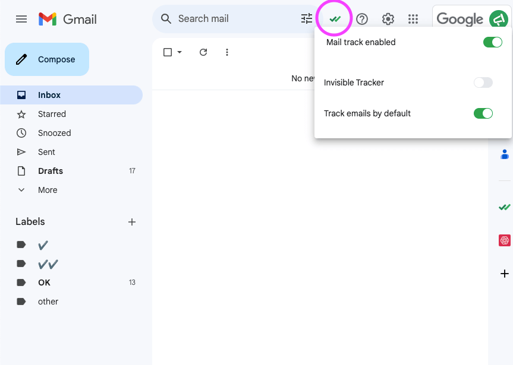

# Chrome extension help

### How to enable the extension :&#x20;

<figure><figcaption></figcaption></figure>

* Go to your Gmail Inbox,
* In the top right corner, click on the Mail Track icon
* Enable the extension&#x20;

### More detailed documentation is available here:


[installation.md](installation.md)



[send-a-tracked-email.md](send-a-tracked-email.md)



[email-tracking-report.md](email-tracking-report.md)



[settings.md](settings.md)

