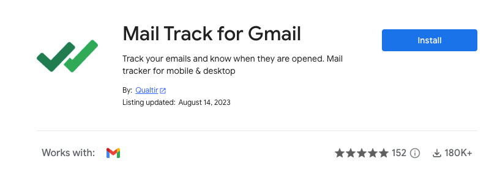

# Installation

## Install Mail Track for Gmail 

Install Mail Merge for Gmail from the [Google Workspace marketplace](https://workspace.google.com/marketplace/app/mail\_merge\_for\_gmail\_%F0%9F%93%A3/562406866377) if you haven’t already done so by clicking on the “Install” button.

<figure><figcaption>
Install Mail Track for Gmail from the Google Workspace Marketplace
</figcaption></figure>

* A pop-up will ask for your permission to install the add-on, click on Continue
* Another popup will ask you for some permissions, click on "Allow"

After the installation (it usually takes less than 15 seconds) you will get a popup, saying that the add-on has been installed.

## Launch Mail Track for Gmail 

<figure><figcaption>
How to launch Mail Track for Gmail add-on
</figcaption></figure>

* Go to your Gmail Inbox (if Gmail was already opened, refresh the page)
* In the sidebar, on the right, click on Mail Track for the Gmail icon

## Installation issues: 

There are two known issues that we can't fix, as it doesn't depend on Mail Track for Gmail:

**1- The add-on doesn't seem to be installed successfully / I never get the "add-on installed successfully" popup:**

This issue can occur when you sign in to Google accounts, and you are not using the principal account for installation. An easy workaround is to open a private window, sign in to the Google account you want, and then proceed to the installation.

**2- After successful installation, Mail Track is not visible in Gmail:**

Simply refresh Gmail, wait for 10 seconds, and it should appear in the menu!
